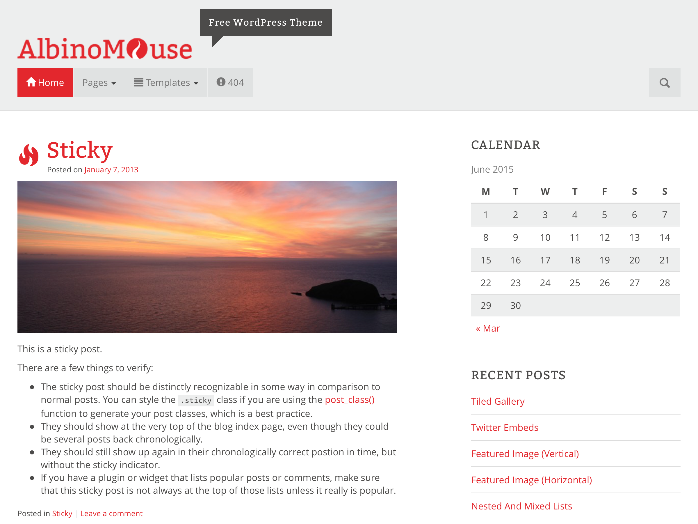

AlbinoMouse
===========

**AlbinoMouse is a responsive WordPress theme with a clean and flat design.**

* It's based on the awesome [starter theme underscores](https://github.com/Automattic/underscores.me) and [framework Bootstrap 3](http://getbootstrap.com/).
* It's a clean blogging theme, however you might use it for something else.
* There are theme options available which allow you to customize the theme in your way. 
	* Upload your own logo,
	* change the primary color which is used for links and the footer background,
	* choose from included Google Fonts,
	* choose from different sidebar layouts,
	* and so on
* It comes with four different page templates.
* AlbinoMouse has been translated into five different languages so far.

##License##
AlbinoMouse is licensed under [GPL v3](https://github.com/pixelstrolch/AlbinoMouse/blob/master/license.txt). The theme was built on some awesome frameworks and other great includes. Anyway, all code is open source.

##Credits##
####AlbinoMouse is built on the following frameworks:####
* [Bootstrap 3](https://github.com/twbs/bootstrap) by Mark Otto and Jacob Thornton (Apache License)
* The starter theme [underscores](https://github.com/Automattic/underscores.me) by Automattic
* [Customizer Library](https://github.com/devinsays/customizer-library) by Devin Price

####There is even more great stuff included:####
* [wp-bootstrap-navwalker](https://github.com/twittem/wp-bootstrap-navwalker) by @tittem (GPL v2)
* [FitVids](https://github.com/davatron5000/FitVids.js) by Chris Coyier and Paravel (WTFPL)
* [HTML5 Shiv](https://github.com/aFarkas/html5shiv) by Alexander Farkas, Jonathan Neal and Paul Irish (MIT/GPL v2)
* [Respond.js](https://github.com/scottjehl/Respond) by Scott Jehl (MIT)
* [Glyphicons Halflings](http://glyphicons.com) by Jan Kovařík comes with Bootstrap 3 (same license)

####These guys make AlbinoMouse international:####
* French translation by [Alexis Jurdant](http://effingo.be/)
* German translation by myself, [Stefan Brechbühl](http://www.pixelstrol.ch/)
* Roumain translation by Van Testing
* Polish translation by [Michał Hunger](http://blog.13mhz.kapa.pl/)
* Spanish translation by [Pablo Laguna](http://pablolaguna.es)

Your language is not listed above? We would love it when you [help us and translate the theme into your language](https://webtranslateit.com/en/projects/11023-AlbinoMouse).